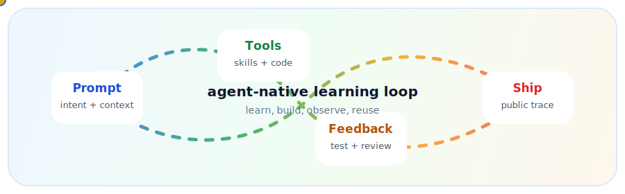
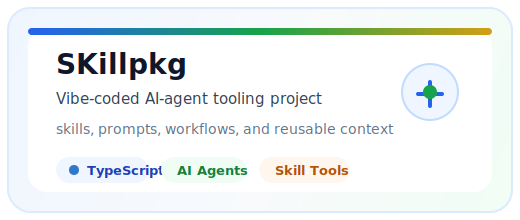
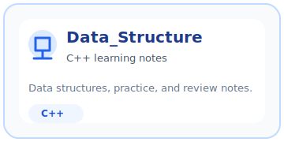
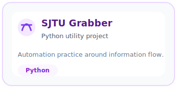
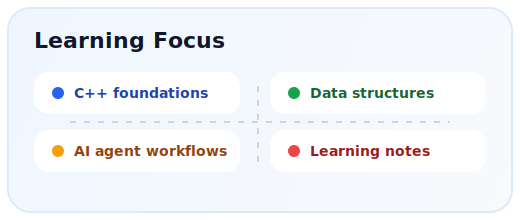
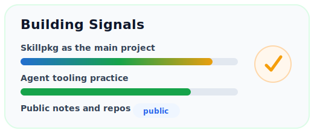

  

  
  
  
  

   
   

  

---

<table>
  <tr>
    <td width="58%" valign="top">
      <h3>Hi, I am Richard.</h3>
      

        I am currently in a learning-and-building stage: strengthening my C++ foundation,
        practicing data structures, and using AI agents as a serious coding partner rather
        than just a chat box.
      

      

        My current center of gravity is <b>agent-native development</b>: giving tools,
        context, reusable skills, and feedback loops to coding agents, then shipping real
        projects through that workflow.
      

    </td>
    <td width="42%" valign="top" align="center">
      
    </td>
  </tr>
</table>

## Featured Build

### Skillpkg

Skillpkg is the project I want to highlight most here.

It is my main <b>vibe-coded AI-agent tooling project</b>: a place where I explore how
skills, prompts, reusable workflows, and project context can become practical building
blocks for coding agents.

What it represents:

- Turning AI-agent usage from "asking questions" into repeatable engineering workflow.
- Learning TypeScript and tool design through a real project.
- Building in public while keeping the project useful for my own daily coding.

 

## Public Learning Trail

  
  

## Current Stack

  

## GitHub Signals

  
  

  

## Contribution Animation

<!--
  This image is generated by .github/workflows/snake.yml after the repository
  is pushed to GitHub and GitHub Actions has run at least once.
-->

<picture>
  <source media="(prefers-color-scheme: dark)" srcset="https://raw.githubusercontent.com/Richardlxr/Richardlxr/output/github-contribution-grid-snake-dark.svg" />
  <source media="(prefers-color-scheme: light)" srcset="https://raw.githubusercontent.com/Richardlxr/Richardlxr/output/github-contribution-grid-snake.svg" />
  
</picture>

  

